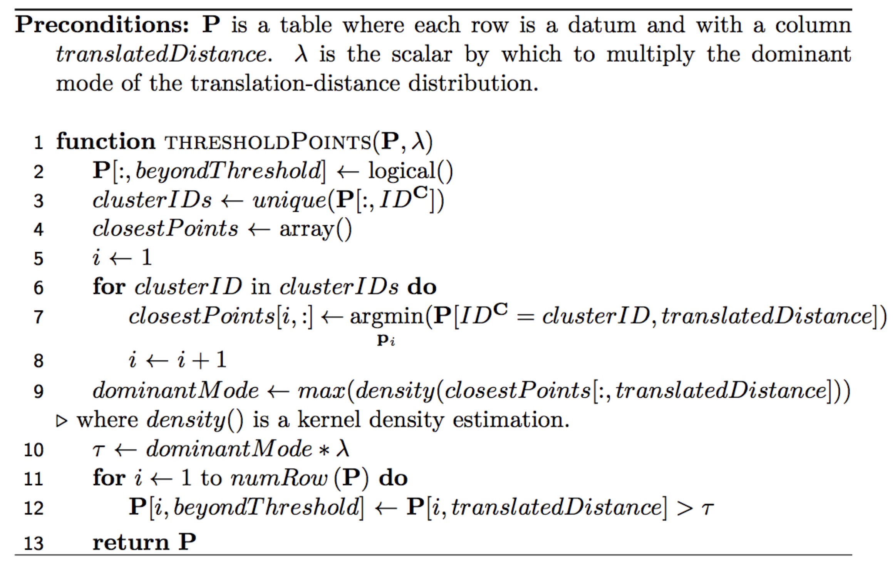

# AssignPointsToExistingClusters

 Algorithms for assigning points in one dataset to clusters in another dataset.  Ideally, if we have two datasets that represent the same objects in the real world, there would be an unambiguous correspondence between the two datasets.  Though, this is not usually the case when working with real world data.  Hence, this repository exists.

 Finding correct correspondences between datasets is particularly important when training and testing supervised machine learning models.  These algorithms have been specifically developed for finding matches between in situ data and clusters in remotely sensed point clouds (such as from lidar and Structure from Motion), though the ideas will generalize to other contexts in machine learning in which the goal is to match points in one dataset to clusters in another dataset.

